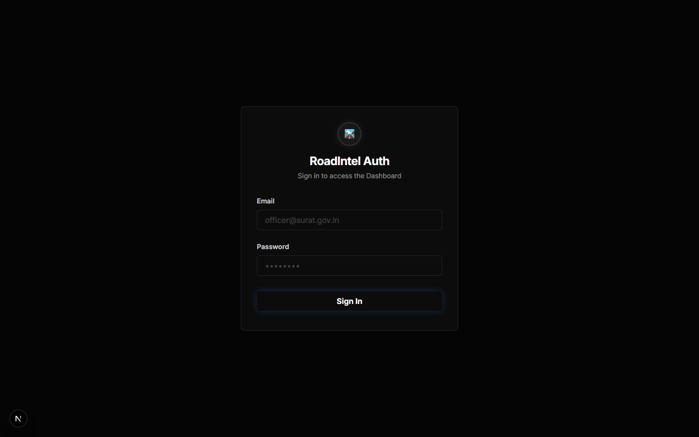
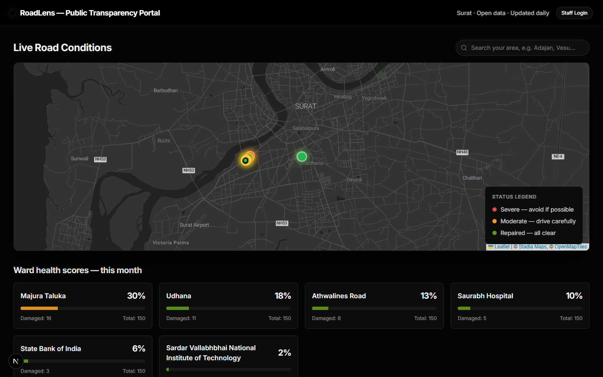
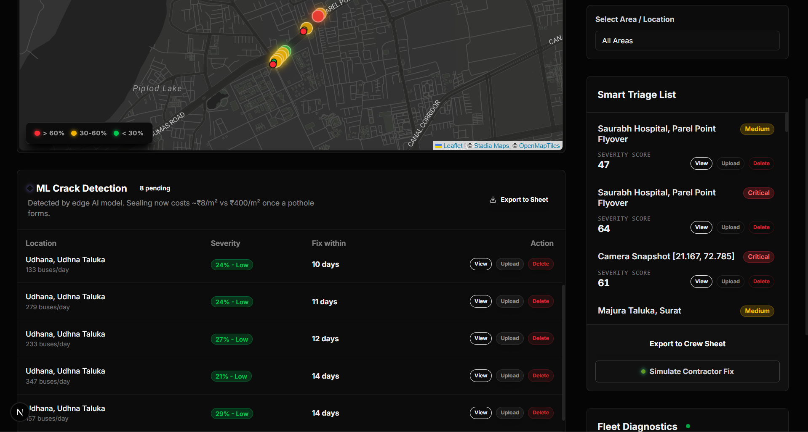

# 🛣️ RoadLens: Autonomous Smart City Road Audit System

Welcome to **RoadLens**, a full-stack, AI-powered predictive maintenance ecosystem designed for municipal corporations to automatically detect, prioritize, and seamlessly manage road decay before it becomes unmanageable.

---

## ⚠️ Problem Statement
Road maintenance currently relies heavily on manual citizen grievances and slow, expensive physical periodic surveys. By the time a pothole is reported, the structural damage is profound, resulting in high repair costs and public frustration. Furthermore, maintenance crews are often dispatched randomly, sequentially, or politically—rather than being prioritized mathematically based on true public traffic disruption. 

## ❌ Initial Solutions vs. 🚀 Our Improvisation

**The Standard Approach:** Restricting road management to static grievance web-portals, WhatsApp/Twitter complaint scraping, and standalone manual physical inspections. 

**Our Improvisation:** 
1. **Passive Edge Tracking**: Instead of buying expensive custom scanning vehicles, we mount standard Raspberry Pi cameras to the dashboards of public transit fleets (like SMC City Buses) that *already* organically drive every single street in the city every day. 
2. **Offline AI Processing**: The edge devices run a refined YOLOv8 object detection model locally to spot "early longitudinal/alligator cracks" and "potholes," safely batch-syncing them to the cloud only when a mobile 4G network is cleanly available.
3. **True "Smart" Triage**: The Command Dashboard doesn't just arbitrarily list potholes. We developed an algorithm that multiplies physical **Severity** by the specific **Buses Per Day** (Traffic Density) crossing that exact coordinate. This yields an ultimate *Priority Score*, mathematically guaranteeing crews deploy to the most disruptive anomalies first.
4. **Live Geocoding**: Utilizes the OpenStreetMap Nominatim reverse-geocoder to auto-magically translate mathematical GPS coordinates to authentic human-readable street profiles (e.g. Udhana, Adajan) during ingestion.
5. **Radical Transparency**: We provide a Citizen Public Interface that dynamically generates "Regional Health Scores" derived *strictly* from the live real-time AI computer vision pipeline rather than forged dummy data.

---

## 💿 Database Architecture (Schemas)
Built entirely on top of **Supabase (PostgreSQL)**, our remote synchronization schema is relentlessly lightweight:

### `incidents` (The Anomaly Core)
Stores the physical road anomalies mapped by the fleet.
- `id` (uuid): Primary key
- `lat` / `lng` (float8): Spatial mapping
- `location_name` (text): Real street address (Nominatim Reverse Geocoded)
- `type` (text): e.g., `pothole` or `early_crack`
- `severity_score` (int): Physical damage intensity scale (0-100)
- `buses_per_day` (int): Public transit frequency marker (Traffic multiplier)
- `fix_deadline_days` (int): AI-suggested repair deadline
- `status` (text): `active` or `repaired`

### `fleet` (Hardware Diagnostics)
Monitors the edge node hardware statuses.
- `bus_id` (varchar): Unique fleet vehicle marker
- `status` (varchar): Telemetry states (`synced`, `offline`)
- `last_sync_time` (timestamp)

---

## 🎥 Output Video Demonstration
Watch the edge system parse, identify, and localize road anomalies sequentially using the locally tuned YOLO Model:

<video src="./final_video1.mp4" controls="controls" muted="muted" playsinline="playsinline" style="max-width: 100%;">
  Your browser does not support the video tag.
</video>

> *Fallback link:* [Click here to view final_video1.mp4](./final_video1.mp4)

*(Note: The `final_video1.mp4` asset sits at the root of the repository compiled directly from the pipeline's detection buffer).*

---

## 📸 Dashboard & UI Screenshots
*(Below are placeholder slots. Please drop your finalized screengrabs here before deploying to GitHub!)*

### SMC Command Center

> *The unified command center highlighting real-time map anomaly scaling, regional filters, the ML Crack Detection Queue, and the math-driven Smart Triage List.*

### Citizen Transparency Portal

> *The frontend Public Transparency View tracking live, dynamically generated Regional Health percentages powered autonomously by bounding box densities.*

### Mobile Edge Output & Platform Views

> *Extended views of the Edge AI anomaly identification pipeline and RoadLens internal tracking interface.*

---

## 🔧 Technical Stack
- **Frontend / UI**: Next.js 15 (App Router, React 19), Tailwind CSS, Lucide React
- **Mapping Infrastructure**: React-Leaflet + Stadia Smooth Dark Themes
- **Backend / Authentication**: Supabase (PostgreSQL)
- **External Integrations**: Google Sheets API (for Automated Repair Crew Submissions) & Nominatim Geocoding
- **AI / Edge Automation Scripting**: Python 3.12, Ultralytics YOLOv8, OpenCV 
